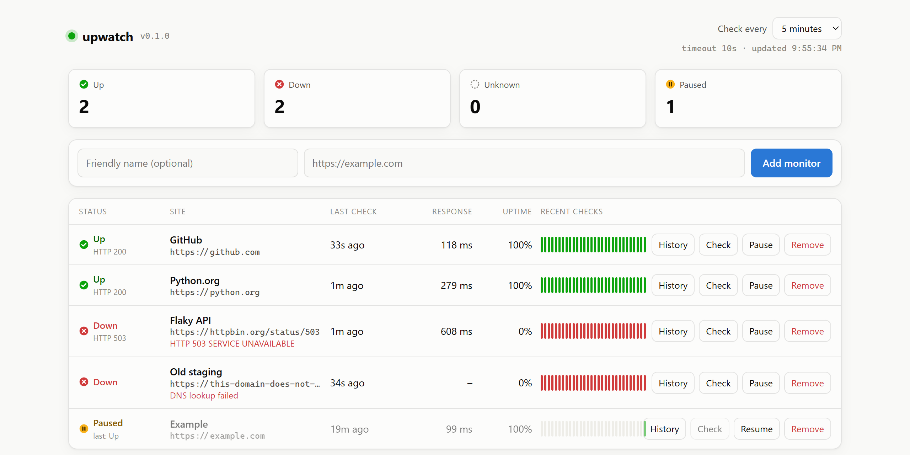
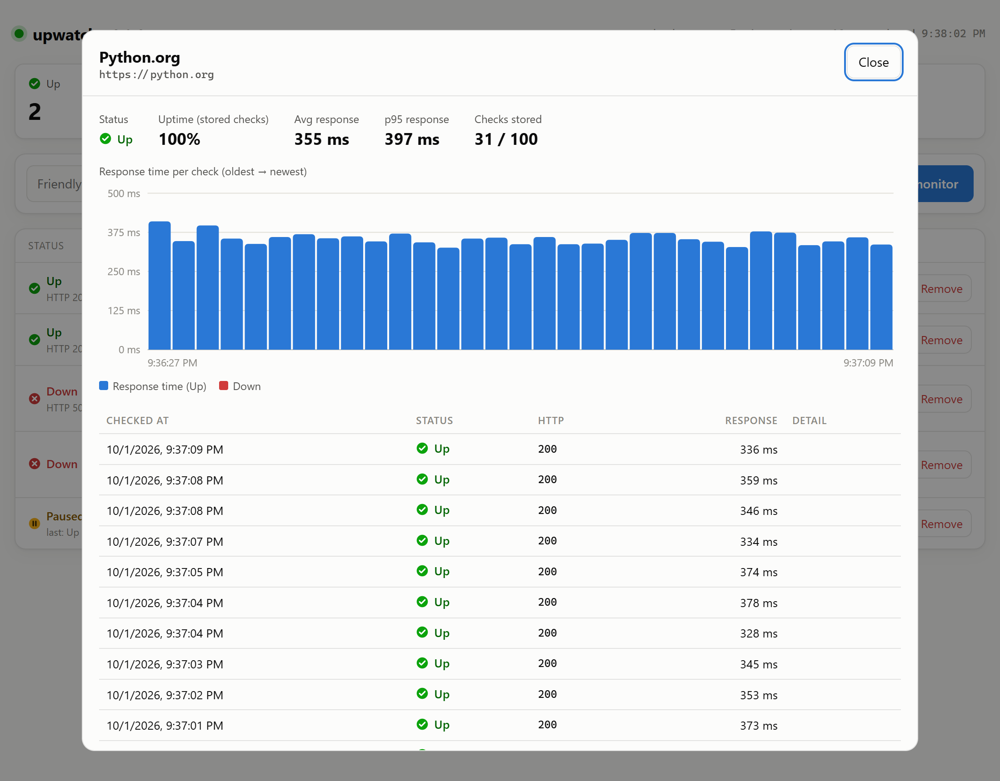

<div align="center">


# upwatch

**A tiny, self-hosted uptime monitor for a handful of URLs.**<br>
One command to install, one command to run. A clean local dashboard and a scriptable CLI. Zero dependencies.

[](https://github.com/jayspyroyale/upwatch/actions/workflows/tests.yml)


[](LICENSE)

[Quick start](#-quick-start) ·
[Dashboard](#-the-dashboard) ·
[CLI](#-command-line) ·
[How checks work](#-how-checks-work) ·
[Run it 24/7](#-keep-it-running-in-the-background) ·
[API](#-http-api)

<br>

<picture>
  <source media="(prefers-color-scheme: dark)" srcset="docs/dashboard-dark.png">
  
</picture>

</div>

---

## Why upwatch?

You have a few websites, APIs or home-lab services and you just want to know: **is it up, and when did I last check?** Hosted status services want an account; big monitoring stacks want a weekend. upwatch runs on your own computer, stores everything in one SQLite file and gets out of your way.

- **Add a URL and a friendly name** from the dashboard or the terminal
- **Up / Down / Unknown** status for every site, at a glance
- **Last check time and response time**, plus an uptime % and a strip of recent checks
- **History** for each site: a response-time chart and a table of the last 100 checks
- **Pause, resume or remove** monitors whenever you like
- **Automatic checks every 5 minutes**, changeable from a dropdown in the dashboard, with a request timeout
- **Private by default:** the dashboard only listens on `localhost`
- **Scriptable:** `--json` output and meaningful exit codes for cron jobs and CI
- **Nothing to install but Python:** standard library only, works on Windows, macOS and Linux

## 🚀 Quick start

You need **Python 3.10 or newer** ([download](https://www.python.org/downloads/)). Check with `python --version`.

**1. Install**

```bash
pip install git+https://github.com/jayspyroyale/upwatch.git
```

> Prefer isolated installs? Use [`pipx`](https://pipx.pypa.io/): `pipx install git+https://github.com/jayspyroyale/upwatch.git`

**2. Start it**

```bash
upwatch serve --open
```

Your browser opens **http://localhost:8321**. Leave the terminal window open; that's what does the checking.

**3. Add your sites**

Type a name and a URL into the dashboard and press **Add monitor**. The first check runs within a few seconds, then every 5 minutes after that. Want it more or less often? Use the **Check every** dropdown at the top right.

That's it. 🎉 Press `Ctrl+C` in the terminal to stop. Your monitors and history are saved, and they'll pick up where they left off next time you run `upwatch serve`.

<details>
<summary><b>Windows: "upwatch is not recognized as a command"?</b></summary>

pip installed the command into a folder that isn't on your `PATH`. Either run it through Python instead (every command works this way):

```powershell
python -m upwatch serve --open
```

or install with `pipx`, which sets up `PATH` for you (`pip install pipx`, then `pipx ensurepath`).
</details>

<details>
<summary><b>Run from source without installing</b></summary>

```bash
git clone https://github.com/jayspyroyale/upwatch.git
cd upwatch
python -m upwatch serve --open
```
</details>

## 🖥 The dashboard

| What you see | What it means |
|---|---|
| **Summary tiles** | How many sites are Up, Down, Unknown (not checked yet) or Paused |
| **Status** | ✅ **Up**, ❌ **Down**, ◌ **Unknown**, ⏸ **Paused**, always with an icon *and* a label, plus the HTTP code |
| **Last check** | How long ago the latest check ran (hover for the exact time) |
| **Response** | How long the latest check took, in milliseconds |
| **Uptime** | Share of the stored checks (up to 100) that were Up |
| **Recent checks** | The last 30 checks, oldest → newest; hover any bar for details |

**Check every** (top right) sets how often sites are checked: 1 minute up to 24 hours, or **Custom…** for any number of seconds from 10 to 86,400. The change applies immediately and is remembered next time you start upwatch.

Each row has buttons to see **History**, **Check** right now, **Pause**/**Resume**, and **Remove** (click twice to confirm). The page refreshes itself every few seconds and follows your system's light/dark theme.

**History** opens a response-time chart and a table of the last 100 checks with the HTTP code and the reason for any failure. You can link straight to it: `http://localhost:8321/#history-3`.

<div align="center">

</div>

## ⌨ Command line

Everything the dashboard does is also available from the terminal. Monitors can be referred to by **ID or name**.

```console
$ upwatch add https://github.com --name GitHub
Added #1 GitHub -> https://github.com

$ upwatch add python.org          # https:// is assumed; name defaults to the hostname
$ upwatch check                   # check everything right now
ID  STATUS  NAME         RESPONSE  DETAIL
1   UP      GitHub       187 ms
2   UP      python.org   336 ms
3   DOWN    Flaky API    1074 ms   HTTP 503 SERVICE UNAVAILABLE
4   DOWN    Old staging  -         DNS lookup failed

$ upwatch list
ID  STATUS  NAME         URL                             LAST CHECK  RESPONSE  DETAIL
1   UP      GitHub       https://github.com              2m ago      187 ms
...

$ upwatch history GitHub --limit 5
$ upwatch pause "Old staging"
$ upwatch remove 4
```

| Command | What it does |
|---|---|
| `upwatch serve` | Run the scheduler **and** the dashboard. Options: `--port 8321`, `--interval SECONDS` (saved for next time), `--timeout 10`, `--host 127.0.0.1`, `--open`, `--verbose` |
| `upwatch add URL [-n NAME]` | Add a site to monitor |
| `upwatch list` (`ls`) | Show every monitor with its current status. `--json` for machine-readable output |
| `upwatch history MONITOR` | Show recent checks. `--limit N` (max 100), `--json` |
| `upwatch check [MONITOR...]` | Check now and save the results. Exits with code **2** if anything is down |
| `upwatch pause MONITOR` / `resume MONITOR` | Stop / restart scheduled checks |
| `upwatch remove MONITOR` (`rm`) | Delete a monitor and its history. `-y` skips the confirmation |
| `upwatch --version` | Print the version |

Global option: `--db PATH` uses a different database file. Run `upwatch <command> --help` for details.

### Scripting

```bash
# Cron / CI: fail the job if any site is down
upwatch check || echo "something is down"

# Feed into jq
upwatch list --json | jq -r '.[] | select(.status == "down") | .url'
```

## 🔍 How checks work

Every active monitor is checked once per **interval** (default **5 minutes**; change it in the dashboard). Making it shorter takes effect right away: any site whose last check is older than the new interval is checked within seconds. upwatch sends an HTTP `GET`, follows redirects, and records:

| Result | Status |
|---|---|
| Final response is `1xx`–`3xx` (e.g. `200 OK`) | ✅ **Up** |
| Final response is `4xx` or `5xx` (e.g. `404`, `503`) | ❌ **Down** |
| No response before the **timeout** (default **10 s**) | ❌ **Down** |
| DNS failure, connection refused, TLS/certificate error | ❌ **Down** |
| Never checked yet | ◌ **Unknown** |

- **Response time** is measured until the response headers arrive.
- **History** keeps the **100 most recent checks per URL**; older ones are deleted automatically.
- **New monitors** are checked within a few seconds. After a restart, sites that are overdue get checked right away.
- Up to 8 sites are checked in parallel, so one slow site never delays the others.
- Requests identify themselves with the user agent `upwatch/<version>`.

## ⚙ Configuration

| Setting | How to change it | Default |
|---|---|---|
| Check interval | The **Check every** dropdown in the dashboard, or `upwatch serve --interval 60` (seconds, 10 to 86400). Either way it's saved in the database | `300` (5 min) |
| Timeout | `upwatch serve --timeout 5` (seconds) | `10` |
| Dashboard port | `upwatch serve --port 9000` | `8321` |
| Listen address | `upwatch serve --host 0.0.0.0` | `127.0.0.1` (this computer only) |
| Database file | `--db path/to/file.db` or the `UPWATCH_DB` environment variable | `~/.upwatch/upwatch.db` |

> [!WARNING]
> The dashboard has **no login**. If you use `--host 0.0.0.0` to open it from another device, anyone on that network can add or remove monitors. Only do this on networks you trust, or put it behind a reverse proxy with authentication.

## 🔁 Keep it running in the background

`upwatch serve` only checks while it's running. To keep it going after you close the terminal:

<details>
<summary><b>Linux (systemd user service)</b></summary>

Create `~/.config/systemd/user/upwatch.service`:

```ini
[Unit]
Description=upwatch uptime monitor

[Service]
ExecStart=%h/.local/bin/upwatch serve
Restart=on-failure

[Install]
WantedBy=default.target
```

Then:

```bash
systemctl --user daemon-reload
systemctl --user enable --now upwatch
loginctl enable-linger "$USER"   # keep running when you log out
```

Use `which upwatch` to find the right path for `ExecStart`.
</details>

<details>
<summary><b>macOS (launchd)</b></summary>

Create `~/Library/LaunchAgents/dev.upwatch.plist` (use `which upwatch` for the path):

```xml
<?xml version="1.0" encoding="UTF-8"?>
<!DOCTYPE plist PUBLIC "-//Apple//DTD PLIST 1.0//EN" "http://www.apple.com/DTDs/PropertyList-1.0.dtd">
<plist version="1.0">
<dict>
  <key>Label</key><string>dev.upwatch</string>
  <key>ProgramArguments</key>
  <array><string>/usr/local/bin/upwatch</string><string>serve</string></array>
  <key>RunAtLoad</key><true/>
  <key>KeepAlive</key><true/>
</dict>
</plist>
```

Then `launchctl load ~/Library/LaunchAgents/dev.upwatch.plist`.
</details>

<details>
<summary><b>Windows (start automatically at login)</b></summary>

In PowerShell:

```powershell
$action  = New-ScheduledTaskAction -Execute "pythonw.exe" -Argument "-m upwatch serve"
$trigger = New-ScheduledTaskTrigger -AtLogOn
Register-ScheduledTask -TaskName "upwatch" -Action $action -Trigger $trigger
```

`pythonw.exe` runs it without a console window. Remove it later with `Unregister-ScheduledTask upwatch`.
</details>

<details>
<summary><b>Anywhere: just cron</b></summary>

Don't need the dashboard running all the time? Let cron do the checking and open the dashboard only when you want to look:

```cron
*/5 * * * * upwatch check > /dev/null
```
</details>

## 🔌 HTTP API

The dashboard is built on a small JSON API you can use too. Requests that change anything must include the header `X-Upwatch: 1` (this stops other websites in your browser from changing your monitors).

| Method & path | Description |
|---|---|
| `GET /api/monitors` | All monitors with status, last check, uptime and recent checks |
| `POST /api/monitors` | Add one: `{"url": "https://example.com", "name": "Example"}` |
| `GET /api/monitors/{id}` | One monitor |
| `GET /api/monitors/{id}/checks?limit=100` | Check history, newest first |
| `POST /api/monitors/{id}/pause` · `/resume` · `/check` | Pause, resume, or check right now |
| `DELETE /api/monitors/{id}` | Remove a monitor and its history |
| `GET /api/info` | Version, interval (and its allowed range), timeout and database path |
| `POST /api/settings` | Change the check interval: `{"interval": 600}` (seconds, 10 to 86400) |

```bash
curl -X POST localhost:8321/api/monitors -H "X-Upwatch: 1" \
     -H "Content-Type: application/json" -d '{"url":"https://example.com"}'
```

## 🧑‍💻 Development

```bash
git clone https://github.com/jayspyroyale/upwatch.git
cd upwatch
python -m unittest discover -s tests -t . -v
```

The tests spin up a throwaway local web server, so they never touch the internet. The code is small and stdlib-only:

```
upwatch/
├── checker.py     # one HTTP check -> up/down, status code, response time
├── scheduler.py   # background loop: which monitors are due, run them in a thread pool
├── store.py       # SQLite storage, keeps the latest 100 checks per monitor
├── server.py      # JSON API + serves the dashboard
├── cli.py         # the `upwatch` command
└── static/index.html   # the dashboard (vanilla HTML/CSS/JS, no build step)
```

## 🗺 Roadmap

upwatch deliberately starts small: reliable checks first. Ideas for later, once the basics have proven themselves:

- Alerts (email, Slack/Discord webhooks, desktop notifications)
- Keyword / page-change detection
- Per-monitor intervals and timeouts
- Longer-term reports

Contributions and ideas are welcome. Open an [issue](https://github.com/jayspyroyale/upwatch/issues) or a pull request.

## License

[MIT](LICENSE)
